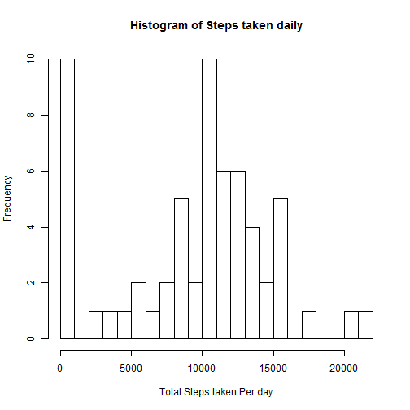
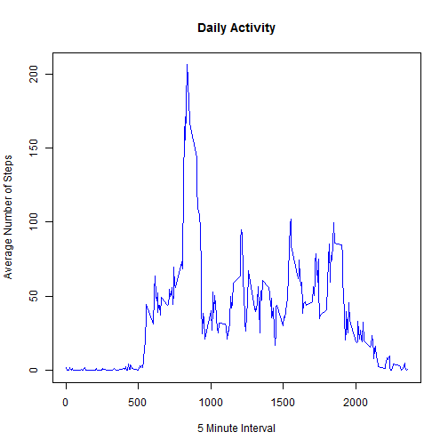
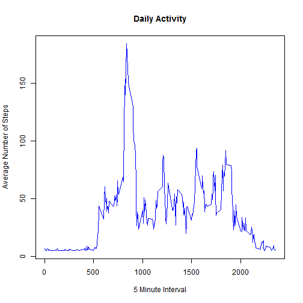
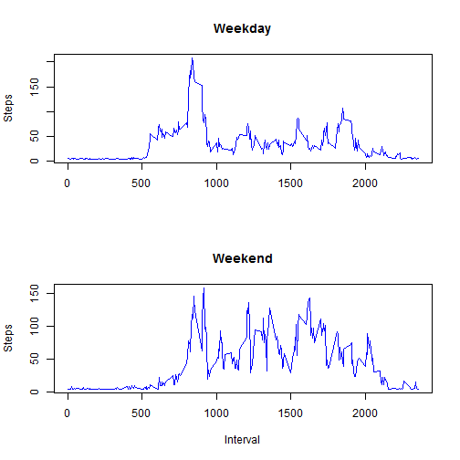

Reproducible Research Assignment 1
==================================

**Loading and preprocessing the data**
  
*The following code assumes the activity.csv data file to be in the working directory.

1. It loads the csv file, 
2. Sets the date type and then 
3. Classifies them as Weekday or Weekend.

It returns a data frame in the end*


```r
load <- function(filename) {
  # Just load the given activity file
	f=read.csv(filename, header=TRUE)

	# set the date field as Date type
	f$date=as.Date(f$date)

	f$day = 0
	# if Saturday or Sunday, mark as 1
	f$day[weekdays(f$date)=='Saturday' | weekdays(f$date)=='Sunday'] = 1

	# Make it a Factor type
	f$day = factor(f$day, levels=c(0,1), labels=c('Weekday','Weekend'))

	return (f)	
} 
```

**What is mean total number of steps taken per day?**

A Basic check on structure of the data frame:


```r
f=load('activity.csv')
```

Check the output of the data frame's structure:

```r
str(f)
```

```
## 'data.frame':	17568 obs. of  4 variables:
##  $ steps   : int  NA NA NA NA NA NA NA NA NA NA ...
##  $ date    : Date, format: "2012-10-01" "2012-10-01" ...
##  $ interval: int  0 5 10 15 20 25 30 35 40 45 ...
##  $ day     : Factor w/ 2 levels "Weekday","Weekend": 1 1 1 1 1 1 1 1 1 1 ...
```

For now, we **ignore** missing values in the data set

The following function takes the raw data frame of the activities and returns a frame with daily sums of the steps taken.


```r
getDailySteps <- function (dframe){
  # Get daily steps total removing NAs from original data
	# Note: if the Dataframe is already clean, na.rm=TRUE doesnt hurt

	dailySums = aggregate(dframe$steps, by=list(dframe$date), FUN=sum, na.rm=TRUE)
	names(dailySums) = c('date', 'steps')
	# Now you have a dataframe showing total daily steps by Date
	return(dailySums)
}
```

Using the above mentioned getDailySteps function, the following R function plots the daily steps:


```r
plotHistogram <- function (dframe) {
  df=getDailySteps(dframe)
	hist(df$steps, breaks=ceiling(max(df$steps)/1000), main="Histogram of Steps taken daily", xlab='Total Steps taken Per day', ylab='Frequency')
}
```

The *Output* of Daily steps Histogram:


```r
plotHistogram(f)
```

 

Lets define a couple of functions for mean and mean total number of steps taken per day


```r
getMean <- function(dframe) {
  return (mean(getDailySteps(dframe)$steps))
}

getMedian <- function(dframe) {
	return (median(getDailySteps(dframe)$steps))
}
```

The output of mean and median using the above functions are given below:


```r
getMean(f)
```

```
## [1] 9354
```

```r
getMedian(f)
```

```
## [1] 10395
```

**What is the average daily activity pattern?**

Let's make a time series plot (i.e. type = "l") of the 5-minute interval (x-axis) and the average number of steps taken, averaged across all days (y-axis)

Note that while computing the average number of steps on a given 5 minute interval, we ingnore NAs


```r
dailyActivityPattern <- function(f) {
  av= aggregate(f$steps, FUN=mean, by=list(f$interval), data=f, na.rm=TRUE)
  names(av) = c('Interval','Steps')
  plot(av$Interval, av$Steps, col="blue", type="l", xlab='5 Minute Interval', ylab='Average Number of Steps', main='Daily Activity')    
}
```

The output is shown below:


```r
dailyActivityPattern(f)
```

 

From the chart, it appears the the activity peaks between 8 and 9 am in the morning.
This analysis above so far includes NAs. 

#Imputing Missing Values

Lets clean up the NAs and analyze the data.
Number of rows in the data frame with steps showing up as NA can be found by 


```r
nrow(f[is.na(f$steps),])
```

```
## [1] 2304
```

Lets use mean of the steps for those periods without missing values to replace the NAs for simplicity


```r
getCleanFrame <- function (dframe) {
  # Use average of those without NAs for those with NAs
	m = mean(dframe$steps, na.rm=TRUE)

	# Update the frame replacing the NAs and return new frame
	dframe[which(is.na(dframe$steps)),]$steps = m
	return (dframe)
}
```

Replacing the older frame with a clean one


```r
cleandata = getCleanFrame(f)
```

Now, lets try plotting the Histogram on the clean frame


```r
dailyActivityPattern(cleandata)
```

 

Lets compute the mean and median of the Cleaned up data frame


```r
getMean(cleandata)
```

```
## [1] 10766
```

```r
getMedian(cleandata)
```

```
## [1] 10766
```

Clearly the mean has shifted by the clean up while the median remains unchanged.

**Are there differences in activity patterns between weekdays and weekends?**

We had already marked the days as *Weekdays* or *Weekends* during preprocessing stage upon data file load.

Below is a plot function that does the following:
1. Makes subsets of weekdays and weekend data separately
2. Does an aggregation by peiod of the day on each
3. plots them in a 2x1 panel


```r
plotCharts <- function (f) {

    par (mfrow=c(2,1))
    wd = subset(f, factor(day)=="Weekday")
    we = subset(f, factor(day)=="Weekend")
    wdi= aggregate(wd$steps, FUN=mean, by=list(wd$interval), data=wd)
    wei= aggregate(we$steps, FUN=mean, by=list(we$interval), data=we)
    names(wdi) = c('Interval','Steps')
    names(wei) = c('Interval','Steps')
    plot(wdi$Interval, wdi$Steps, col="blue", type="l", xlab='', ylab='Steps', main='Weekday')    
    plot(wei$Interval, wei$Steps, col="blue", type="l", xlab='Interval', ylab='Steps', main='Weekend')    
    
}
```

The *output* of executing the above function is given below:


```r
plotCharts(cleandata)
```

 

Clearly, compared to weekdays, folks are a bit more active in the weekend afternoons. One way to look at it is whoever this was measured on was in general not that active during weekday afternoons but seems to be relatively more active on the weekend. He/she peaks typically at around 8:35 am on activity. However, after a friday night hangover, there is a slight shift in the activity pickup time. But, once a pattern similar to a typical morning warming up period is complete, on a weekend, the activities are more than during weekdays. I imagine he/she is doing a relatively sendantary office job during the weekdays.

